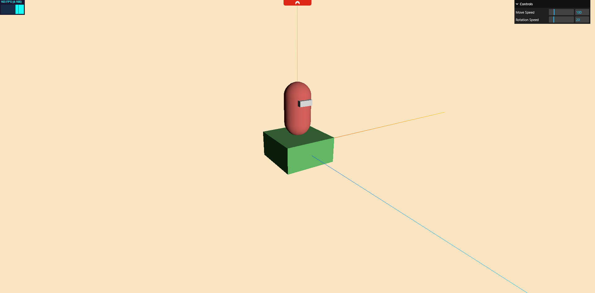

# Top Down Game with Three.js

This project is an attempt to create a top-down game using [Three.js](https://threejs.org/) for graphics and [Rapier](https://rapier.rs/) for physics.

## Getting Started

Follow these steps to try the latest build:

1. **Clone the Repository**

   ```bash
   git clone git@github.com:YUVRAJg37/ProjectM.git
   cd projectM
   ```

2. **Install Dependencies**

   ```bash
   npm install
   ```

3. **Run the Development Server**

   ```bash
   npm start
   ```

4. **Open in Browser**
   - Visit `http://localhost:5173` (or the port shown in your terminal).

## How to Play

- Use **WASD** keys to run.

## Screenshots



## Requirements

- Node.js and npm installed

## Notes

- This is a work in progress. Feedbacks are welcome!
